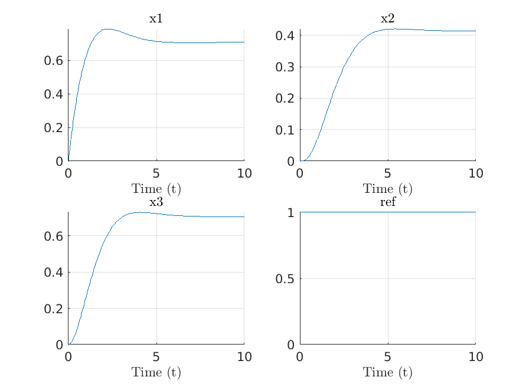

OneModel
=========
OneModel is a MATLAB class which simplifies working with ODE models. The main objetive is to simplify the process of coding and simulating an ODE model, and therefore reducing the time spent in this task. With OneModel one can program ODE models from the symbolic equations and then simulate directly. This class provides also some functionality like OpenModelica (i.e. extendable classes, simulation of DAE models, etc).

Apart from that, OneModel provides us more classes for different tasks. For example, there is a class for mathematical analysis that can calculate equilibrium points, linearize the model, and calculate eigenvalues from the model defined in OneModel. On other hand, there is class for a contractivity test to check whether a model is contractive or no.

Lastly it is even possible to define OneModel models from chemical reactions directly and then perform QSSA analysis and simulate.

For more information please contact fersann1@upv.es

# Installation

Download this repository into the directory of your choice. Then within MATLAB go to `HOME/ENVIROMENT >> Set path` and add the directory of the repository and the `utils` and `parser` directories to the list (if they aren't already).

OneModel is developed for Matlab R2020b. OneModel was not tested to work in earlier versions of Matlab.

## Use the MATLAB syntax highlight with the .mc files

In `Preferences` go to `Editor/Debugger`. Then in `Language` in the box File extensions add `mc` as a new extension for MATLAB files.

# Table of contents

* [Installation](#installation)
	* [Use the MATLAB syntax highlight with the .mc files](#use-the-matlab-syntax-highlight-with-the-mc-files)
* [Table of contents](#table-of-contents)
* [Documentation](#documentation)
* [General workflow](#general-workflow)
	* [1. Defining a model with the OneModel syntax](#1-defining-a-model-with-the-onemodel-syntax)
	* [2. Simulate the OneModel model](#2-simulate-the-onemodel-model)
	* [3. Plot simulation results](#3-plot-simulation-results)
	* [4. Generate an ODE function](#4-generate-an-ode-function)
	* [5. Mathematical analysis](#5-mathematical-analysis)
	* [6. Contractivity test](#6-contractivity-test)
	* [7. Parser of OneModel models into LaTeX](#7-parser-of-onemodel-models-into-latex)


# Documentation

OneModel has a documentation manual placed in the following [link](doc/manual.pdf).

# General workflow

This section will explain the general workflow of using OneModel. An example will be presented to illustrate each of the steps of the workflow, and the code used in this example can be found in the following [link](./examples/ex0_readme).

## 1. Defining a model with the OneModel syntax

The first step is to code the information of the model we want to work with in the OneModel syntax. This syntax is similar to OpenModelica and it allows us to define a lot information about the model (variables, equations, comments, references, etc.). 

Therefore the first step is to create a file with the `.mc` extension (this is the extension used to defined OneModel models). This file will containg all the information of our model, and we have to use the OneModel syntax. In principle, the `.mc` files cannot have Matlab code but for avanced options it is posible to combina Matlab and OneModel syntax in the same `.mc` file.

The OneModel syntax consist on a set of predefined commands that will define some information in the model. The basic three commands are:  `parameter`, which defines a value that will not vary during simulation time; `variable`, which defines a value that could change during simulation time; and `equation`, which defines a relationship between parameters and variables. The `variable` can be defined as algebraic or as dynamic. The use of a command is typically as follows:

```
commandName name;
```

The `commandName` is the name of the command we want to use, `name` is the name we want to use for the object generated by the command and note that each command must finish with a `;`. 

For example:

```
parameter A;
```

This way we are using the command `parameter` to define an parameter for our model with the name `A`.

Some commands have the possibility to define options, using the following structure:

```
commandName name(opt1 = value1, opt2 = value2);
```

The option `opt1` will be set to the value `value1`, and note the `,` between different options. This way:

```
parameter A(value = 1.0);
```

, will create a parameter `A` and its `value` property will be set to `1.0`.

Everything written after a `%` until the next new line is considered as a comment.
This way the line `% Variables` will not define information of the model, but it will improve the readability of the model.
It is recommended to properly comment on the models.

For example, a OneModel model defined with this syntax will look something like this (./examples/ex0_readme/model.mc):

```MATLAB
% Variables

variable x1;
variable x2;
variable x3;
variable ref(value = k3/d3);

% Parameters

parameter k1(value = 1.0);
parameter k2(value = 1.0);
parameter k3(value = 1.0);
parameter d1(value = 1.0);
parameter d2(value = 1.0);
parameter d3(value = 1.0);
parameter gamma12(value = 1.0);

% Equations

equation der_x1 == k1    - gamma12*x1*x2 - d1*x1;
equation der_x2 == k2*x3 - gamma12*x1*x2 - d2*x2;
equation der_x3 == k3*x1 - d3*x3;
```

and the models are initialized with the following function:


```MATLAB

% Initialize an object of the model.
m = OneModel.load('./model/model.mc');

% Display variables and equations of the model.
disp('Variables of the model:');
m.vars
disp('Equations of the model:');
m.eqns
```

```
Compiling model...
Compilation finished.
Model is loading...
Model is loaded.
Variables of the model:
 
ans =
 
 x1
 x2
 x3
ref
 
Equations of the model:
 
ans =
 
   der_x1 == k1 - d1*x1 - gamma12*x1*x2
der_x2 == k2*x3 - d2*x2 - gamma12*x1*x2
                der_x3 == k3*x1 - d3*x3
                           ref == k3/d3
 
```

## 2. Simulate the OneModel model

Once we have a OneModel model it is easy to start simulating it. We need to pass a OneModel object of our model to the SimulationClass. Then we can configure the options for the simulation (e.g. parameters of the model, initial conditions, ODE configuration, which ODE solver to use, time span, ...). And finally we can use the functions for simulating and the SimulationClass will return a struct with the results of the simulation.

```MATLAB

% Initialize a SimulationClass object with the model data.
s = SimulationClass(m);

% Simulation time span.
tspan = [0 10];

% Parameters of the model.
p = []; % They are already defined in "model.mc"
% p.d1 = 10;

% Intial conditions of the model.
x0 = [];
x0.x1 = 0.000000;
x0.x2 = 0.000000;
x0.x3 = 0.000000;

% Options for the solver.
opt = odeset('AbsTol', 1e-8, 'RelTol', 1e-8);

% Simulate the model.
[out] = s.simulate(tspan,x0,p,opt);

% Result of the simulation.
disp('Result of the simulation:');
out
```

```
Result of the simulation:

out = 

  struct with fields:

          t: [154x1 double]
         x1: [154x1 double]
         x2: [154x1 double]
         x3: [154x1 double]
        ref: [154x1 double]
         k1: [154x1 double]
         k2: [154x1 double]
         k3: [154x1 double]
         d1: [154x1 double]
         d2: [154x1 double]
         d3: [154x1 double]
    gamma12: [154x1 double]

```

## 3. Plot simulation results

The SimulatePlotClass simplifies the task of plotting the result of simulations. And if we define plot configuration in our OneModel, the PlotClass will use that information. This way do not need to provide it when plotting.

```MATLAB

% Initialize a SimulationPlotClass object with the model data.
sp = SimulationPlotClass(m);

% Plot the result of the simulation.
sp.plotAllStates(out);

% Save the plot.
saveas(gcf,'simulationPlot.png')
```


<p align="center">
  
</p>

## 4. Generate an ODE function

We could use OneModel as our main workflow for working with models. However there are situations where we want to obtain a matlab ODE function (i.e. a function that calculates the derivatives of the model from the states). In this case, there is a functionality in the SimulationClass that generates the ODE function automatically for us. Also it can generate a driver script that simulates using the generated ODE function (this script could be used as a start template for using the ODE function).

With the following code you can generate the ODE function and the driver script:

```MATLAB 

% Generate an ode function of the model.
s.generateOdeFunction();
% Generate the driver script for the ode function.
s.generateDriverOdeFunction();

```

, the contents of the generated ODE funtion (./examples/ex0_readme/build/modelOdeFun.m) are:

```MATLAB
function [dxdt] =  modelOdeFun(t,x,p)
%% MODELODEFUN Function that evaluates the ODEs of model.mc
% This function was autogenerated with OneModel v0.5.1 95580f4   -   Fernando Nóbel (fersann1@upv.es).
%
% param: t Current time in the simulation.
%      : x Vector with states values.
%      : p Struct with the parameters.
%
% return: dxdt Vector with derivatives values.

% States
% x(1,:) = x1
% x(2,:) = x2
% x(3,:) = x3

% der(x1)
dxdt(1,1) = p.k1-p.d1.*x(1,:)-p.gamma12.*x(1,:).*x(2,:);

% der(x2)
dxdt(2,1) = -p.d2.*x(2,:)+p.k2.*x(3,:)-p.gamma12.*x(1,:).*x(2,:);

% der(x3)
dxdt(3,1) = -p.d3.*x(3,:)+p.k3.*x(1,:);

end
```

and the content of the generated driver script (./examples/ex0_readme/driver/modelDriverOdeFun.m) are:

```MATLAB
%% Driver script for simulating the ODE function modelDriverOdeFun
% This script was autogenerated with OneModel v0.5.1 95580f4   -   Fernando Nóbel (fersann1@upv.es).

clear all;
close all;

% Mass matrix for algebraic simulations.
M = [
	1	0	0	
	0	1	0	
	0	0	1	
];

% Options for the solver.
opt = odeset('AbsTol',1e-8,'RelTol',1e-8);
opt = odeset(opt,'Mass',M);

% Simulation time span.
tspan = [0 10];

% Default initial condition value.
x0 = [
	 0.000000e+00 % x1
	 0.000000e+00 % x2
	 0.000000e+00 % x3
];

% Default parameters value.
p.k1 = 1.000000e+00;
p.k2 = 1.000000e+00;
p.k3 = 1.000000e+00;
p.d1 = 1.000000e+00;
p.d2 = 1.000000e+00;
p.d3 = 1.000000e+00;
p.gamma12 = 1.000000e+00;

[t,x] = ode15s(@(t,x) modelOdeFun(t,x,p), tspan, x0, opt);

plot(t,x);
legend('x1','x2','x3');
grid on;
```

Finally, we can simulate by executing the driver script.

## 5. Mathematical analysis

Work in progress.

## 6. Contractivity test

Work in progress.

## 7. Parser of OneModel models into LaTeX

Work in progress.

